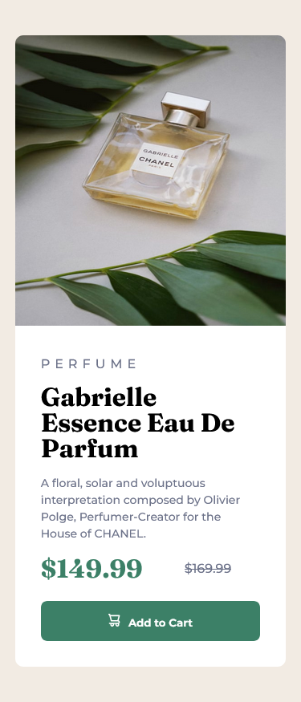

# Frontend Mentor - Product preview card component solution


Esta é uma solução para o [desafio do componente do cartão de visualização do produto no Frontend Mentor](https://www.frontendmentor.io/challenges/product-preview-card-component-GO7UmttRfa).

## Índice

- [Overview](#overview)
  - [Desafio](#desafio)
  - [Screenshots](#screenshots)
  - [Links](#links)
- [Meu processo](#meu-processo)
  - [Desenvolvido com](#desenvolvido-com)
  - [O que eu aprendi](#o-que-eu-aprendi)
  - [Desenvolvimento contínuo](#desenvolvimento-contínuo)
  - [Recursos úteis](#recursos-úteis)
- [Autor](#autor)

## Overview

### Desafio

Os usuários devem ser capazes de:

- Visualize o layout ideal dependendo do tamanho da tela do dispositivo
- Veja os estados de hover e foco para elementos interativos

### Screenshots
### Versão Desktop

### Versão Mobile


### Links

- Live Site URL: [https://reynald-durans.github.io/Product-preview-card-component/](https://reynald-durans.github.io/Product-preview-card-component/)

## Meu processo

### Desenvolvido com

- Semantic HTML5 markup
- CSS custom properties
- Flexbox
- CSS Grid

### O que eu aprendi

Esse projeto me fez entender um pouco mais de grid components e usar shorthands para deixar o código mais limpo e legível, como por exemplo:

```css
/* Criando um grid container com duas colunas com espaçamento de 1rem */
.cartao {
  display: grid;
  grid-template-columns: auto auto;
  column-gap: 1rem;
}
```

Já em css aprendi mais detalhes em trabalhar com a aparência dos textos como:

```css
.cartao__descricao {
  line-height: 150%; /* Espaçamento de 150% entre as linhas */
}

.cartao__preco--antigo {
  text-decoration: line-through; /* Linha ao meio do texto */
}
```

Em questão de responsividade aprendi mais sobre media queries e usando modo landscape.

```css
@media screen and (orientation: landscape) and (max-width: 875px) {
  .container__principal {
    width: 50%;
    height: 90%;
  }

  .cartao {
    width: 50%;
  }
}
```

### Desenvolvimento contínuo

A partir deste projeto quero continuar aprendendo conceitos de responsividade e melhorar meu entendimento sobre grid components, a partir deste ponto meus planos é aprender SASS para estender meu conhecimento em CSS.

### Recursos úteis

- [Guia de unidades no CSS](https://www.alura.com.br/artigos/guia-de-unidades-no-css) - Esse artigo me ajudou a entender melhor entre medidas absolutas e relativas do CSS.
- [Como fazer uma div ocupar a página inteira? ](https://pt.stackoverflow.com/questions/197270/como-fazer-uma-div-ocupar-a-p%C3%A1gina-inteira) - Eu estava em dúvida em como ocupar 100% do body pra usar corretamente o display flex sem ficar a barra de rolagem, então o essa resposta neste fórum me ajudou.

## Autor

- Website - Reynald
- Frontend Mentor - [@reynald-durans](https://www.frontendmentor.io/profile/reynald-durans)
- Twitter - [@reynald_durans](https://twitter.com/reynald_durans)
